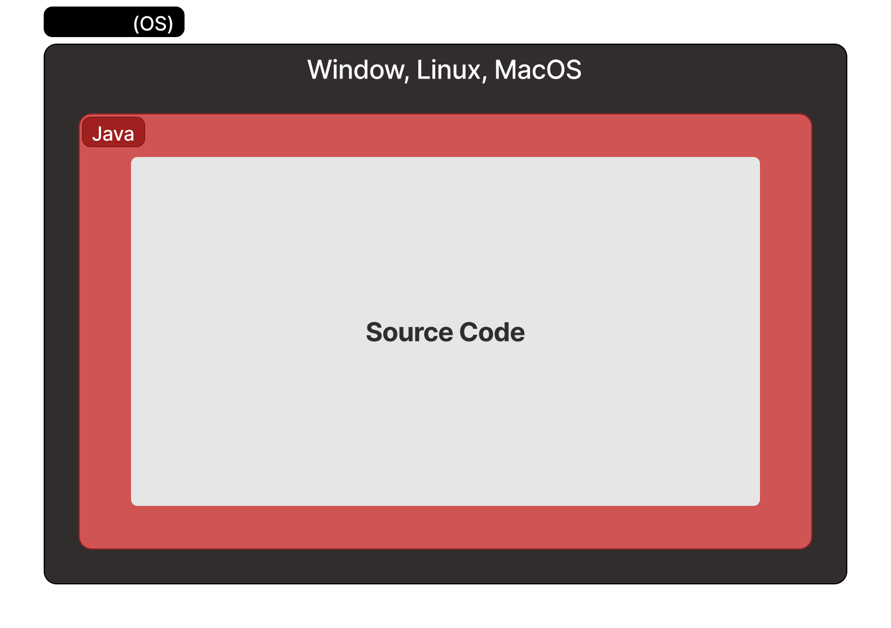

# Java 설치하기

## Java의 동작

1. 소스코드 작성
2. 컴파일
3. 실행

## Java의 설치

### Java SE

- Java SE(Java Platform, Standard Edition)은 자바의 표준안이다.
- Java SE 7은 버전 7에 대한 명세서이다. 
- JCP(Java Commnunity Process)라는 조직을 통해서 만들어진다.

### JDK

- Java Development Kit
- 컴파일러, 개발에 필요한 각종 도구 그리고 JRE가 포함되어 있다.

### JRE