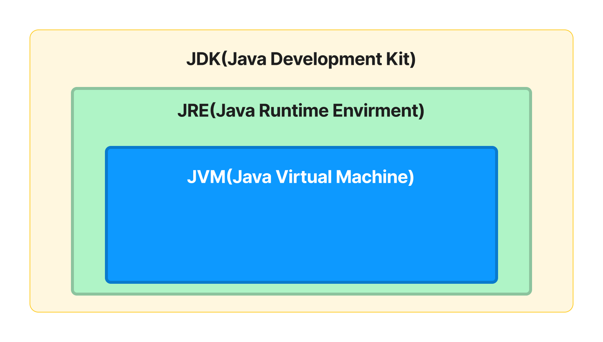

# Java 설치하기

## Java의 동작

1. 소스코드 작성
2. 컴파일
3. 실행

## Java의 설치

 

### Java SE

- Java SE(Java Platform, Standard Edition)은 자바의 표준안이다.
    - 자바 언어가 가진 정보, 문법 구성 등을 정의하고 있다.
- Java SE 7은 버전 7에 대한 명세서이다. 
- JCP(Java Commnunity Process)라는 조직을 통해서 만들어진다.
- Java라는 소프트웨어의 설계도라고 생각하면된다.
- 이외에도 기업용으로 나온 Java EE, 모바일로 설계된 Java ME 등도 있다.

 

### JDK

- Java Development Kit
- Java SE를 따라서 만든 소프트웨어
- Java컴파일러(Javac), 다수의 Java 개발도구, JRE 등을 포함하고있다.
- 개발자들이 Java로 프로그램을 만들때 사용한다.

 

### JRE(Java Runtime Environment)

- Java가 동작하는데 필요한 JVM(Java Virtual Machine), 라이브러리, 각종파일 등을 포함하고 있다.
- Java를 실행시키기 위해 필요한 것이다.
- 일반인들이 Java로 구성된 프로그램을 사용하기 위해서 사용해야한다.

 

### JVM(Java Vritual Machine)

- Java가 실제로 구동하는 환경이다.
- H/W, OS 등에서의 호환문제를 해결해준다.
    - 어떤 환경에서도 동일하게 작동할 수 있다.

 

아래와 같은 관계를 띄고있다.

 

 

## Java의 버전

Java의 버전을 부르는 것이 조금씩 차이가 있어 헷갓릴 수 있다.

Java SE 7은 JDK 1.7이라고도하고, JDK 7라고도 한다.

 

## JDK의 종류

- Java SE - 기본적으로 사용되는 JDK이다.
- Java EE - 기업용으로 사용되는 JDK이다.
- Java ME - 모바일용으로 사용되는 JDK이다.