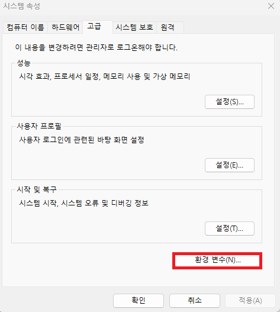
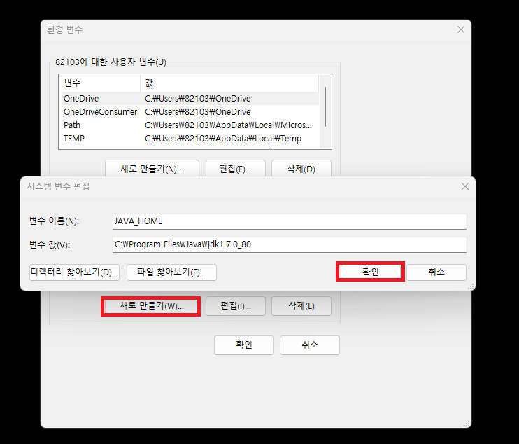
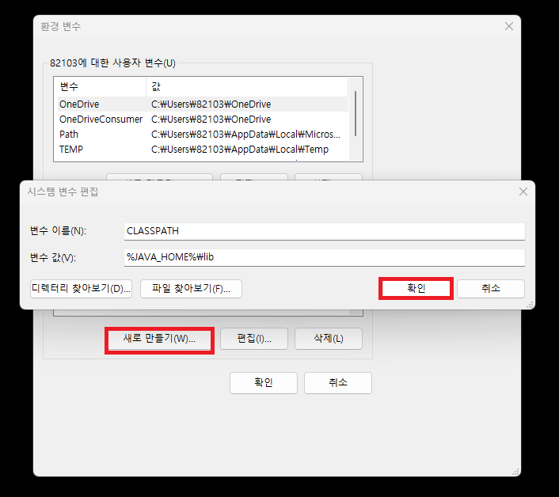
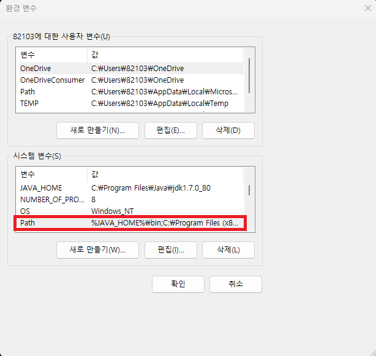
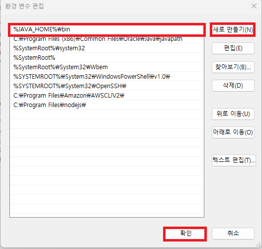
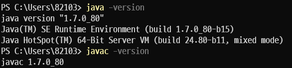

# Java 설치

## Linux

Ubuntu 환경에 Java 설치

현재 우분투 버전

```bash
$ lsb_release -a

No LSB modules are available.
Distributor ID: Ubuntu
Description:    Ubuntu 22.04.3 LTS
Release:        22.04
Codename:       jammy
```

### Java 설치하기(Ubuntu)

```bash
$ sudo apt-get update
$ sudo apt-get upgrade

$ sudo apt-get install openjdk-8-jdk
```

apt를 최신화한뒤에 JDK를 설치한다.

설치가 완료되었는지 확인하기 위해서 다음의 명령어를 사용한다.

```bash
## 자바 버전확인
$ java -version

## 자바 컴파일러 버전확인
$ javac -version
```

<br>

### Java 환경변수 설정하기

```bash
$ sudo gedit ~/.profile

## 위의 명령어가 없을 경우 gedit을 설치한다
## gedit은 GNOME 데스크톱 환경에서 사용되는 기본적인 텍스트 편집기이다(문서 편집기)
$ sudo apt-get install gedit
```

혹은 vi 명령어를 이용해서 작성해도 무방하다.

```
## 열린 파일에 다음의 설정을 추가하자.
export JAVA_HOME=$(dirname $(dirname $(readlink -f $(which java))))
export PATH=$PATH:$JAVA_HOME/bin
```

작성이 완료되었다면 source 명령어를 이용해 즉시 적용시켜준다.

```bash
$ source ~/.profile
```

적용이 잘 되었는지

```bash
$ echo $JAVA_HOME
```

<br>

<br>

## Window

Window 버전에 Java를 설치해보자.

<br>

### Java 설치하기(Window)

Oracle에서 제공하는 Java JDK를 다운로드 받도록하자.

https://www.oracle.com/java/technologies/javase/javase7-archive-downloads.html

<br>

### Java 환경변수 설정하기

환경변수를 설정해줘야한다.

시스템 환경 변수 창을 연다.


<br>

클릭하면 환경 변수를 설정할 수 있는 창이 열린다.

<br>



<br>

환경 변수 버튼을 클릭한 뒤에



<br>

새로 만들기 버튼을 클릭하여

변수 이름에 `JAVA_HOME`을 적어주고

변수 값에는 JDK가 있는 위치인 C:/Program Files/Java/jdk1.7을 찾아 입력한 뒤에 확인 버튼을 눌러주자.

<br>



마찬 가지로 변수 이름에 `CLASSPATH`

변수 값에 C:/Program Files/Java/jdk1.7/lib 혹은 %JAVA_HOME%/lib을 넣어주어 설정한다.

다음으로는 명령 프롬포트 창이 java, javac 등을 인식할 수 있도록 PATH에 값을 추가해주자.

<br>






위의 과정을 마친후에

터미널을 열어 변수가 적용되었는지 확인해보자.

```bash
$ java -version
$ javac -version
```



정상적으로 출력이 된다면 적용이 되었다.