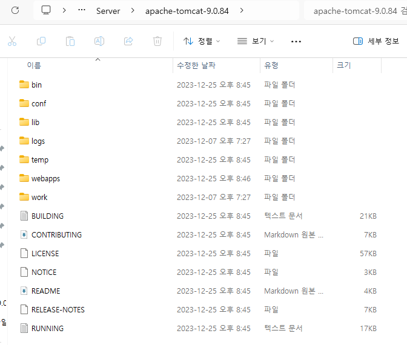

# Tomcat

- Web Application Service - WAS
- `자바 서블릿(Java Servlet)`을 실행하고 `JSP`가 포함된 웹페이지를 만들어준다.
- 톰캣은 웹서버와 연동하여 실행할 수 있는 자바 환경을 제공하고, 관리도구, XML 등을 수정하여 설정을 변경할 수 있다.

    > ※.Servlet
    > 
    > - 서버에서 웹페이지를 동적으로 생성하거나 데이터 처리를 수행하기 위해 자바로 작성된 프로그램.
    > - Java 코드안에 HTML 태그가 삽입되며 JAVA로 작성된다.
    > - 요청을 처리하고 결과를 다시 클라이언트에게 전송하는 "Servlet 클래스"의 구현 규칙을 지킨 자바프로그램이다.

    > ※.JSP(Java Server Pages)
    > 
    > - HTML 내부에 JAVA 코드를 삽입하는 형식
    > - Servlet의 단점을 보완하고자 만든 Servlet 기반의 스크립트 기술

## Tomcat_설치

## Tomcat_디렉토리

- bin: 톰캣 서버를 시작하고 중지하는 데 사용하는 실행 관련 배치/스크립트 파일
- conf: 톰캣 서버의 전반적인 설정을 담당하는 server.xml 파일과 각종 설정 파일
- lib: 톰캣 서버가 실행되는 데 필요한 자바 라이브러리 파일
- logs: 톰캣 서버의 실행 및 애플리케이션 로그를 기록하는 로그 파일
- temp: 톰캣 서버가 실행되는 동안 생성되는 임시 파일
- webapps: 톰캣 서버에서 실행되는 웹 애플리케이션들의 WAR 파일이나 압축을 푼 웹 애플리케이션 디렉토리
- work: JSP 파일을 자바 서블릿 소스로 컴파일한 클래스 파일

## Tomcat_실행확인

- bin 폴더의 startup.bat 실행
    - 바로 꺼질경우 jdk의 환경변수 설정 확인
    - 실행시 글자 깨질경우 tomcat/conf/logging.properties 파일을 연뒤에 `java.util.logging.ConsoleHandler.encoding = EUC-KR로 변경 기본값은 UTF-8`
- localhost:8080로 접속시 톰캣 화면 렌더

> 참고자료
> https://www.snugarchive.com/blog/apache-tomcat-setup/#%ED%99%98%EA%B2%BD%EB%B3%80%EC%88%98-%EC%84%A4%EC%A0%95%ED%95%98%EA%B8%B0