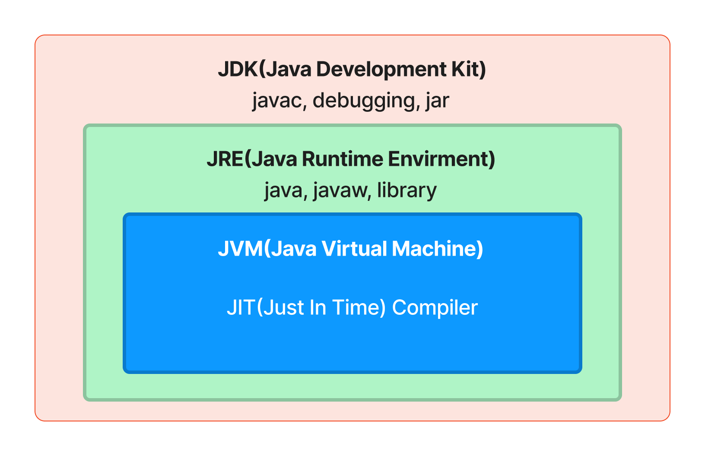
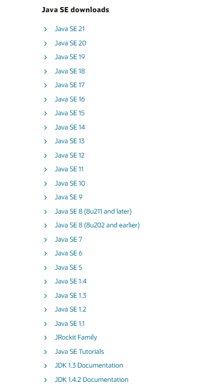
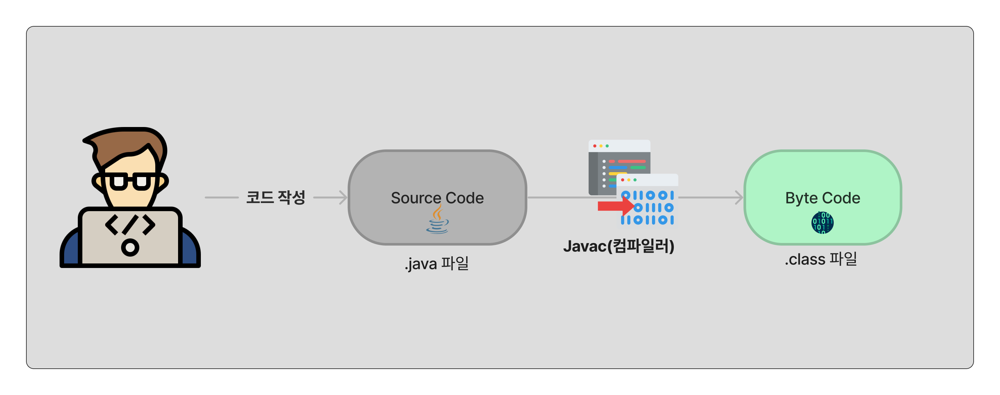
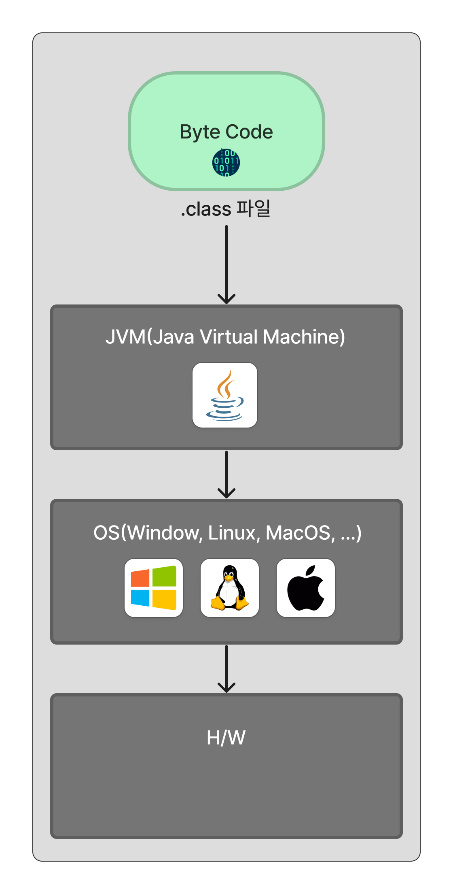

# Java 학습(231227)

- 자바의 생태계를 한 번 알아보자.

## 1. Java의 생태계

### 1.1 Java SE

- `Java platform, Standard Edition`라는 의미를 가지고 있다
- `Java` 언어가 가진 문법 구성을 정의하고 있다
- `Java`라는 소프트웨어의 설계도, 명세서

### 1.2 JDK

- `Java Development Kit`
- 개발자가 자바로 개발을 하기위해서 꼭 필요한 것들이 들어있다
- Java SE를 따라서 만든 소프트웨어이며, Java 컴파일러, Java 개발도구, JRE 등을 포함하고 있다

### 1.3 JRE

- `Java Runtime Environment`
- `Java`가 실행되는 환경이다
- `Java`가 동작하는데 필요한 JVM, 라이브러리, 각종파일 등을 포함하고 있다
- `Java`로 작성된 프로그램을 실행하기 위해서는 반드시 필요하다

### 1.4 JVM

- `Java Virtual Machine`
- Java가 실제로 구동되는 환경이다
- Window, Linux, MacOS 등 OS나 H/W가 달라 C나 C++같은 경우는 각각 다른 컴파일러가 필요한데, Java의 경우 JVM이 각 기기마다의 호환문제를 해결해준다
- Java라는 프로그램이 어느 환경에서도 실행이 될 수 있도록 해준다

 

## 2. JDK, JRE, JVM의 관계

 

위의 그림처럼 JDK 안에 JRE, JVM이 있는 구조이다.

따라서 JAVA로 개발을 하기위해서는 JDK를 다운받으면 된다.

## 3. JDK의 버전과 종류

### 3.1 JDK의 버전

- JDK는 같은 버전이지만 여러 이름으로 불리고 있다.

- 이중에서 중간에 Java SE 1.4 이후부터 Java SE 5 등으로 바뀌었지만, Java SE 5 === Java 1.5와 같은 의미이니 혼동하지말자.
- Java의 최신버전은 다양한 기능이 추가되었지만 유료로 전환되어 보통 JDK 1.8과 같은 무료 버전을 많이 사용한다.

### 3.2 JDK의 종류

JDK는 다음과 같이 세종류로 나뉘어있다.

- Java SE - 일반인
- Java EE - 기업용
- Java ME - 모바일

## 4. Java의 동작원리

위에서 살펴본 JVM이 어떤 역할을 하는지 한번 그림으로 알아보자.

### 4.1 Java의 컴파일

우선 작성한 java코드를 컴퓨터가 읽을 수 있게 컴파일하는 과정이 필요하다.

### 4.2 Java의 실행

컴파일된 클래스파일을 JVM에 넘겨 실행시킨다.

위와 같은 실행 방법으로 어떤 환경에서도 같은 동작을 할 수 있도록 만들어준다.